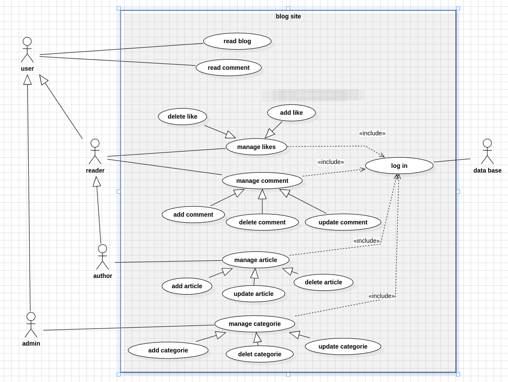
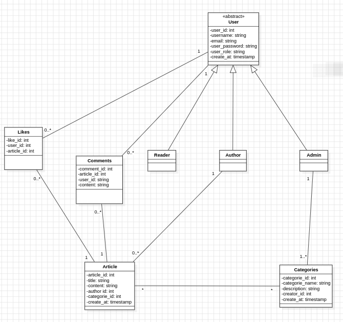

📝 Blog Platform - MVC PHP Project
A complete blog platform built with PHP using MVC architecture. This project demonstrates object-oriented programming, database design, and user management systems.

✨ Features
👥 User Management
Three User Roles: Admin, Author, Reader

Registration & Login System

Profile Management

Role-based Access Control

📝 Blog Management
Create, Edit, Delete Blog Posts

Rich Text Content Support

Post Categorization

💬 Engagement Features
Comments System (Readers & Authors)

Like/Unlike Posts

Comment Replies

🏷️ Content Organization

Category Management (Admin only)

⚙️ Admin Features

Category Management

🏗️ Project Structure

blog-platform/
│
├── app/
│   ├── controllers/
│   │   ├── AuthController.php
│   │   ├── BlogController.php
│   │   ├── AdminController.php
│   │   └── CommentController.php
│   │
│   ├── models/
│   │   ├── User.php
│   │   ├── Post.php
│   │   ├── Comment.php
│   │   ├── Category.php
│   │   └── Like.php
│   │
│   └── views/
│       ├── layouts/
│       ├── auth/
│       ├── blog/
│       ├── admin/
│       └── partials/
│
├── config/
│   ├── database.php
│   └── constants.php
│
├── public/
│   ├── css/
│   ├── js/
│   ├── images/
│   └── uploads/
│
├── vendor/           # Composer dependencies
├── .htaccess
├── index.php         # Front controller
├── composer.json
└── README.md

🚀 Installation
Prerequisites
PHP 7.4 or higher

MySQL 5.7 or higher

Apache/Nginx web server

Composer (optional)

Step-by-Step Setup
1.Clone the repository

git clone https://github.com/Abdelilah-isswa/Blog-site.git
cd blog-platform
2. Configure database
# Import database schema
mysql -u root -p < database/schema.sql

# Or create manually:
# 1. Create database 'blog_db'
# 2. Run SQL from database/schema.sql

# Copy configuration file
cp config/database.example.php config/database.php

# Edit with your database credentials
nano config/database.php

chmod 755 -R public/uploads/
chmod 644 config/database.php

Install dependencies (optional)
composer install

Access the application

http://localhost/blog-platform/public/

👨‍💻 Usage Examples
For Readers:
Register/Login to account

Browse blog posts 

Read full articles

Like posts and leave comments

For Authors:
All Reader features, plus:

Create new blog posts

Edit/Delete your own posts

For Admins:

Create/Edit/Delete categories

use case diagram :

class diagram :

